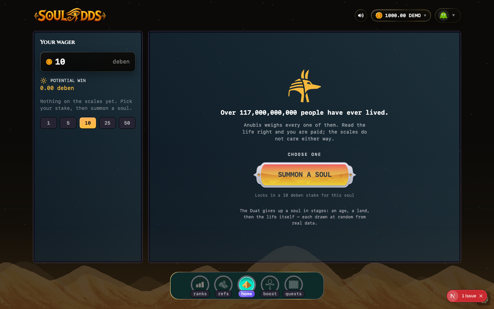

# Soul Odds

<p align="center">
  
</p>

<p align="center">
  Predict a stranger's fate. Anubis weighs the soul; the scales don't care either way.
</p>

Soul Odds ("Mortal Odds") is a single-player casino game built on the **Chain.wtf** platform. The
player wagers on the gender, lifespan bracket, and cause of death (up to two "sins") of a
randomly summoned soul, then the house settles the round on-chain against a real VRF randomness
source. It ships as a Next.js app that plays either standalone (a local in-browser demo, no
wallet needed) or embedded as a sandboxed iframe inside the Chain.wtf host.

This monorepo also holds the `@chain/casino-sdk` bridge SDK the game is built on, its local test
stack, and the on-chain sampler engine. Building your own game on the SDK? Start at
[`docs/CASINO_SDK.md`](docs/CASINO_SDK.md) instead — this README is about the Soul Odds game
itself.

## Features

- **Mortal Odds core loop** — stake, pick gender / lifespan / up to two sins, summon a soul, watch
  the reveal, get paid per-pick at that pick's odds.
- **Ranks** — global leaderboard (`/ranks`).
- **Referrals** — invite links and referral tracking (`/refs`).
- **Quests** — task-based rewards (`/quests`).
- **Badges** and **Stats** — player progression and history (`/badges`, `/stats`).
- **Demo mode** — the game is fully playable outside the Chain.wtf host with a local, persisted
  fake wallet, so anyone can try it in a plain browser tab.
- i18n via `next-intl`, wallet balance / sound / profile controls in the header, Socket.io-backed
  live state.

## How a round works, and where the data comes from

There's no backend RNG and no third-party odds feed. Every round is generated by
[`@chain/soul-odds-engine`](soul-odds-engine), a single immutable on-chain sampler shared by
all "titles" (theme configs). A **title** — the deployed one here is `Mortal Odds`, defined in
[`games/soul-odds/src/config/mortal-odds/soul-odds-title.json`](games/soul-odds/src/config/mortal-odds/soul-odds-title.json) —
fixes an era, a birth-year range, gender weights, exactly four lifespan buckets and four anonymous
"crime" (cause-of-death) slots, each with its own selection and commit weights. A round samples a
soul from those weights using randomness supplied by a real **Verify Network VRF** node
(ECVRF, not a pseudo-random seed).

Payout for a pick is `wager * titleRtp / probability(prediction)` — i.e. the game pays out exactly
the title's RTP in expectation, whatever combination the player chooses. **Current title RTP:
95%** (`rtpWad: "0.95"` in the title config above).

The same sampling logic exists twice, and the engine's test suite cross-checks them bit-for-bit:

- **On-chain** (Solidity, `soul-odds-engine/contracts/`) — the source of truth for real rounds.
- **TypeScript mirror** (`@chain/soul-odds-engine/soul`) — used client-side for the demo host
  described below, so standalone play matches production odds exactly without touching a chain.

## Epitaphs & time stories — how the flavor text is generated

The sampled soul (gender, lifespan, sin) is the bet; everything else on the reveal screen — the
scene-setting line above the wager panel and the epitaph on the reveal card — is flavor text
picked from two curated JSON pools, not written per-round and not model-generated at runtime.

- **Time stories** —
  [`games/soul-odds/src/config/mortal-odds/time-stories.json`](games/soul-odds/src/config/mortal-odds/time-stories.json).
  Each entry is a line tagged with a `[from, to]` year range (e.g. "A cold world still shaking off
  the last great freeze…", `-10000..-8001`). `pickTimeStory` in
  [`games/soul-odds/src/lib/mortal-odds/time-story.ts`](games/soul-odds/src/lib/mortal-odds/time-story.ts)
  is called once per round, from
  [`useMortalOddsDraw.ts`](games/soul-odds/src/hooks/useMortalOddsDraw.ts), right after the birth
  year is sampled: it filters to stories whose range covers that year, weights narrower ranges
  higher (`1 / sqrt(rangeWidth)`, since a specific range says something more specific), skips ids
  shown in the last few rounds so consecutive summons don't repeat a line, and fills a live
  `{people}` token from a world-population curve interpolated for that exact year.
- **Epitaphs** —
  [`games/soul-odds/src/config/mortal-odds/epitaphs.json`](games/soul-odds/src/config/mortal-odds/epitaphs.json).
  Each entry has a `when` clause — AND-ed condition fields (`status`, `ageBand`, `sex`, `cause`,
  `literacy`, `setting`, `sin`, `era`, `region`), OR-ed within a field — that must match the
  sampled soul's actual life facts. `pickEpitaph` in
  [`games/soul-odds/src/lib/mortal-odds/epitaph.ts`](games/soul-odds/src/lib/mortal-odds/epitaph.ts)
  runs at reveal: it keeps only fully-matching entries, weights by specificity
  (`2 ^ number of conditions set`, so a line written for exactly this soul beats a generic
  fallback), applies the same anti-repeat window as time stories, and substitutes placeholders —
  `{he}/{his}/{him}` (pronoun from `life.sex`), `{place}`, `{age}`, `{cause}`, `{sin}` — from the
  sampled life. If nothing matches, a hard-coded alive/dead fallback line is used so the reveal is
  never blank.

Both pools are **linted, not just typed**: `lintTimeStories` / `lintEpitaphs` (same two files)
check every entry's length, reject digits (numbers must go through `{people}`/`{age}`/`{born}`
tokens instead), and run each line's text against ~60 anachronism/consistency patterns — e.g. a
story mentioning "pyramids" must start no earlier than -2600, an epitaph mentioning "plague" must
have its `cause` restricted to catastrophe values, one mentioning "she/her" must be restricted to
`sex: girl`. Coverage checks additionally guarantee every year (`-50000..2100`) has at least 2
eligible time stories, and every `status × ageBand` pair has at least 2 baseline epitaphs — so no
possible sampled soul is ever left without a line. See
[`time-story.test.ts`](games/soul-odds/src/lib/mortal-odds/time-story.test.ts) /
[`epitaph.test.ts`](games/soul-odds/src/lib/mortal-odds/epitaph.test.ts) for the lint run against
the shipped content.

## The Chain.wtf SDK

The game embeds inside the Chain.wtf host as a sandboxed `<iframe>` and never touches a wallet or
signs a transaction itself. Everything crosses a promise-based `postMessage` bridge
(`@chain/casino-sdk`, built on [Penpal](https://github.com/Aaronius/penpal)):

- **Host** (Chain.wtf) owns the wallet, the session keys, and all signing. It pushes state to the
  game via `guestApi.setState(snapshot: HostSnapshotV1)` whenever wallet, balance, or session data
  changes.
- **Guest** (this app, via `@chain/casino-sdk/guest`) only encodes player intent and calls
  `hostApi.openSession`, `hostApi.submitAction`, and `hostApi.revealOutcome` — see
  [`games/soul-odds/src/hooks/useCasinoHost.ts`](games/soul-odds/src/hooks/useCasinoHost.ts).
- The game's manifest — capabilities, presentation mode, locale metadata — lives at
  [`games/soul-odds/public/game.manifest.json`](games/soul-odds/public/game.manifest.json).

Full protocol and the on-chain `ICasinoGameV2` interface the round settles against:
[`docs/CHAIN_WTF_CASINO_GAMES.md`](docs/CHAIN_WTF_CASINO_GAMES.md).

## Requirements

- Node.js 24+
- [pnpm](https://pnpm.io) (auto-installed by `start-dev.sh` if missing)
- [Docker](https://www.docker.com) (local Postgres)
- [bun](https://bun.sh) — only needed for the full stack (simulator + local chain)

## Running it — standalone (fastest, no chain needed)

Opened directly in a browser tab instead of inside the Chain.wtf iframe, the game detects it has
no parent frame (`window.parent === window`, see
[`games/soul-odds/src/lib/demo-host.ts`](games/soul-odds/src/lib/demo-host.ts)) and swaps in a
local, client-side demo host: a fake wallet seeded with 1,000 demo chUSD, sessions persisted to
`localStorage`, and the exact same odds/payout math as production — just no wallet, no chain
call, no VRF round-trip.

```sh
cd games/soul-odds
pnpm install
./start-dev.sh
```

`start-dev.sh` installs pnpm if missing, copies `.env.example` → `.env`, starts a local Postgres
container, runs migrations + seed, and boots the combined Next.js + Socket.io server
(`src/server/index.ts`). Open **http://localhost:3001** (the dev server binds `3001`, not `3000`
— see `src/server/index.ts`).

## Running it — inside the local simulator (real contract, real VRF, real host bridge)

To play an actual on-chain round — the deployed `SoulOddsEngine` contract, a real Verify Network
VRF node, and the exact host↔guest bridge production uses — run the whole stack from the repo
root:

```sh
bun install
bun start
```

This runs, concurrently: the local chain + VRF node, the casino simulator harness (Vite, port
`3300`), the coinflip example game, the Soul Odds app (via `start-dev.sh`, port `3001`), and the
deploy script for the `Mortal Odds` title. Open **http://localhost:3300**, then point the
harness's game URL field at `http://localhost:3001` (an unregistered game is auto-registered on
the local host). See [`simulator/README.md`](simulator/README.md) for what the local backend
spins up and [`docs/LOCAL_SIMULATOR.md`](docs/LOCAL_SIMULATOR.md) for what the harness replicates
from production (optimistic sessions, flashblock vs. indexed lag, stuck-randomness recovery,
etc.).

## Scripts

Run from `games/soul-odds/`:

| Command | What it does |
| --- | --- |
| `pnpm run start` | `start-dev.sh` — Postgres + migrate + seed + combined dev server. |
| `pnpm run dev:next` | Next.js dev server only (no DB/socket bootstrap). |
| `pnpm run game:socket-server` | The combined Next.js + Socket.io server (what `start` boots). |
| `pnpm run build` | Migrate DB, then production build. |
| `pnpm run start:next` | Serve a production build. |
| `pnpm run db:generate` / `db:migrate` / `db:studio` / `db:seed` | Drizzle ORM schema, migrations, browser UI, and seed data. |
| `pnpm run check:types` | `tsc --noEmit`. |
| `pnpm run lint` / `lint:fix` | Ultracite (type-aware). |
| `pnpm run test:unit` | Vitest unit tests. |

## Project structure

```
games/soul-odds/
├── public/game.manifest.json         # Chain.wtf manifest (capabilities, presentation mode)
├── src/app/[locale]/(game)/          # Routed pages: home, ranks, refs, quests, badges, stats
├── src/components/game/              # UI, incl. mortal-odds round flow (stage/reveal/…)
├── src/config/mortal-odds/           # Title config (soul-odds-title.json), epitaphs, time stories
├── src/hooks/useCasinoHost.ts        # Chain.wtf guest/host bridge + standalone fallback
├── src/lib/demo-host.ts              # Standalone/demo host (client-side round simulation)
├── src/lib/mortal-odds/              # Round state, epitaph/time-story pickers, contract config
├── src/server/index.ts               # Combined Next.js + Socket.io server
└── src/services/db/                  # Drizzle schema + queries

soul-odds-engine/    # Immutable on-chain sampler contract + TS mirror + title compiler CLI
simulator/           # Local chain + VRF node + host harness (Vite, port 3300)
```

## Where this is headed

The engine already supports multiple **titles** — different eras, weight tables, and RTPs — as
clones of the same immutable sampler ([`soul-odds-engine/README.md`](soul-odds-engine/README.md));
today only one, `Mortal Odds` (the "Contemporary" all-time era), is deployed. The natural next
steps are additional titles/eras and moving the deployed title from the local/simulator stack to a
production Chain.wtf deployment.

## License

MIT — see [LICENSE](LICENSE).
